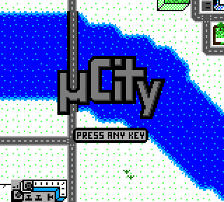
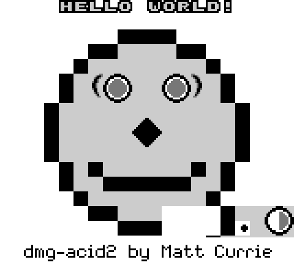
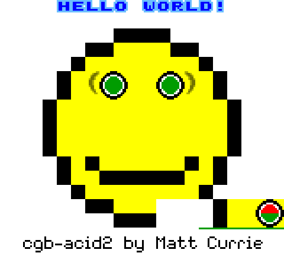
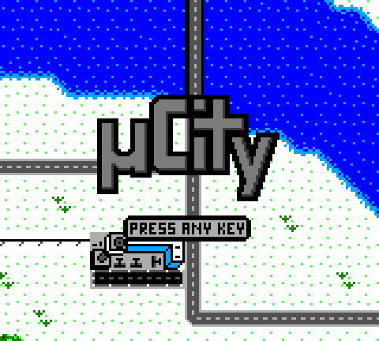

# gbmu

A Game Boy (DMG) and Game Boy Color (CGB) emulator written from scratch in
C++14, with a Qt5 front-end, a built-in debugger, and a headless driver for
scripting and CI.

[](https://github.com/oyagci/gbmu/actions/workflows/ci.yml)

<p align="center">
  
</p>

<p align="center">
  
  
  
</p>

<p align="center">
  <em>dmg-acid2 &middot; cgb-acid2 &middot; <a href="https://github.com/AntonioND/ucity">µCity</a> — all captured headlessly with <code>gbmu-dbg</code>.</em>
</p>

## Accuracy

Every result below is reproducible with the headless driver; see
[Reproducing these results](#reproducing-these-results).

| Test suite | Result |
| --- | --- |
| [Blargg `cpu_instrs`](https://github.com/retrio/gb-test-roms) (11 ROMs) | **11 / 11 pass** |
| [dmg-acid2](https://github.com/mattcurrie/dmg-acid2) | 96.45% of pixels match the reference [^1] |
| [cgb-acid2](https://github.com/mattcurrie/cgb-acid2) | 95.43% of pixels match the reference |

Both acid2 renders are otherwise pixel-exact; every difference falls inside the
two areas listed under [Known issues](#known-issues).

[^1]: Compared after mapping the four grey shades onto each other. gbmu renders
DMG with `$00 $77 $CC $FF`, while dmg-acid2 asks emulators to use
`$00 $55 $AA $FF` so that images can be diffed byte for byte; against the
reference bytes as-is the figure is 68.77%. The CGB row needs no such
adjustment: those colours are byte-exact.

## Features

* **CPU** — the full SM83 instruction set, including `CB` prefixed opcodes,
  interrupts, `HALT`, and `STOP`.
* **PPU** — scanline renderer with background, window, and sprites; the 10
  sprites-per-line limit; sprite/background priority; 8x8 and 8x16 sprites.
* **Colour** — CGB background and object palettes, VRAM banking, and both
  general-purpose and H-Blank HDMA transfers.
* **Audio** — all four channels (two square, wave, noise) with sweep, envelope,
  and length modulation, played through PortAudio.
* **Cartridges** — MBC1, MBC2, MBC3 (with real-time clock), and MBC5, plus
  battery-backed RAM written to disk.
* **Boot ROM** — the DMG and CGB boot sequences run before the cartridge.
* **Debugger** — a Qt window for stepping, breakpoints, disassembly, and memory
  inspection, and a headless equivalent for scripts.

## Dependencies

* clang++ (C++14)
* boost
* portaudio
* qt5 (only for the graphical front-end; `gbmu-dbg` does not need it)

```sh
brew install qt@5 boost portaudio                                    # macOS
sudo dnf install portaudio-devel boost-devel clang qt5-qtbase-devel  # Fedora
sudo apt-get install qt5-qmake portaudio19-dev clang libboost-all-dev # Debian
```

## Build

```sh
./configure && make -j
```

The emulator can be built on macOS or Linux. Some games may not run correctly.

### Docker

Builds on Linux without installing anything locally.

```sh
docker build -t gbmu .
```

The binary is `/gbmu/gbmu` in the image. Tests:

```sh
docker run --rm gbmu make -f RawProject.mk test_sample test_Operations_utils test_Interrupt
```

## Headless debugger

`gbmu-dbg` links the emulator without Qt, for scripting and CI.

```sh
make -f RawProject.mk dbg
./gbmu-dbg <rom.gb> [options]
```

| option | effect |
| --- | --- |
| `-b, --break ADDR` | break at ADDR (hex), repeatable |
| `-n, --steps N` | stop after N instructions |
| `-f, --frames N` | stop after N rendered frames |
| `-t, --trace` | disassemble every instruction |
| `-d, --dump ADDR` | dump 160 bytes at ADDR when stopped |
| `-s, --screenshot F` | write the last frame to F as a PPM; `-` streams every frame to stdout |
| `--dmg` / `--cgb` | force a model (default: auto-detect) |

It exits `0` when it stops normally or a test ROM reports success, `1` on
failure, `2` on the step or frame limit, and `3` on a usage error. Test ROMs
that report over the link port are therefore usable directly as CI assertions.

## Reproducing these results

No ROMs are included in this repository. Download the freely distributable test
ROMs, then:

```sh
# Blargg cpu_instrs: exits 0 on "Passed", 1 on "Failed"
for rom in cpu_instrs/individual/*.gb; do
    ./gbmu-dbg "$rom" -n 30000000 >/dev/null 2>&1
    echo "$? $rom"
done

# A screenshot, scaled up for a README
./gbmu-dbg dmg-acid2.gb --dmg --frames 400 --screenshot out.ppm
magick out.ppm -filter point -resize 300% out.png

# An animated GIF, streaming every frame into ffmpeg
./gbmu-dbg ucity.gbc --cgb --frames 640 --screenshot - 2>/dev/null \
  | ffmpeg -f image2pipe -vcodec ppm -i - \
      -vf "select=between(n\,340\,460),setpts=N/20/TB,scale=iw*2:ih*2:flags=neighbor" \
      -r 20 -loop 0 out.gif
```

## Known issues

* **Window internal line counter.** The window's line counter is not preserved
  correctly across the frame, so the right side of the chin in both acid2 tests
  renders from the wrong tile map row. This is the single largest source of
  pixel differences in both tests.
* **Sprite tile flipping in CGB mode.** The acid2 nose, four objects sharing one
  tile flipped on both axes, is missing in CGB mode but renders correctly in DMG
  mode.
* **Save states** exist in the code but are disabled in the UI.
* Several unit tests under `tests/` predate later API changes in `src/` and no
  longer compile; CI runs the ones that still build.

## Architecture

```
src/cpu/          SM83 core, interrupt controller, timer, joypad
src/PPU.cpp       scanline renderer (background, window, sprites, HDMA)
src/Palettes.cpp  DMG and CGB palette translation
src/sound/        APU: 2 square, wave, and noise channels; PortAudio backend
src/MemoryBus     memory map and dispatch to components
src/MemoryBankController{1,2,3,5}.hpp, RealTimeClock.hpp
src/ui/           Qt5 front-end and debugger window
src/main.cpp      gbmu-dbg, the headless driver
tools/            instruction-table and test-ROM generators
```

Roughly 9k lines of C++ across the core and front-end. The CPU dispatch table in
`src/cpu/instructions.inc` is generated by `tools/gen_instructions.py` from
`tools/instruction_set.txt`.

## Credits

This project is for educational purposes only. The test ROMs pictured are
[dmg-acid2](https://github.com/mattcurrie/dmg-acid2) and
[cgb-acid2](https://github.com/mattcurrie/cgb-acid2) by Matt Currie, and
[µCity](https://github.com/AntonioND/ucity) by Antonio Niño Díaz.
